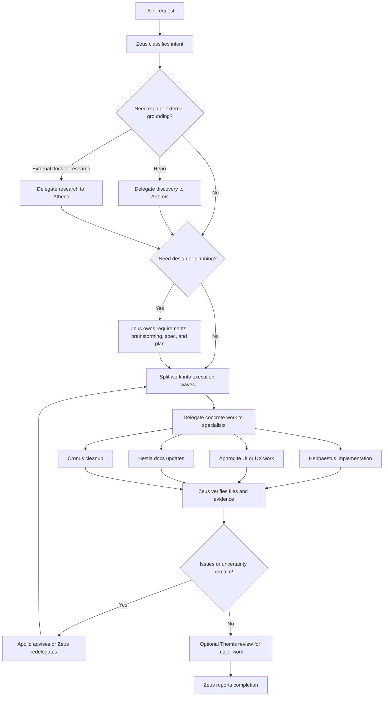

# opencode-config

Reusable [OpenCode](https://opencode.ai) config for agents, commands, skills, plugins, and CLI-backed capability workflows.

## Install

```bash
curl -fsSL https://raw.githubusercontent.com/benihime91/opencode-config/refs/heads/main/install.sh | bash
```

The installer clones the repo, backs up your existing config, symlinks files into `~/.config/opencode`, installs dependencies, and bootstraps a local Firecrawl instance by default when Docker with `docker compose` is available.
It also links `agent-permissions.jsonc` for per-agent skill rules and `mcporter.json` for the shared CLI-backed server definitions.
The default Firecrawl env now lives in this repo at `firecrawl/.env.default`. During bootstrap, the installer updates only the Ollama-related lines, then links `~/firecrawl/.env` back to that repo-owned file so you edit one source of truth.

### Override defaults

You can point the installer at a fork or a different clone path with environment variables:

```bash
OPENCODE_CONFIG_REPO_SLUG="your-user/opencode-config" \
OPENCODE_CONFIG_CLONE_DIR="$HOME/src/opencode-config" \
curl -fsSL https://raw.githubusercontent.com/benihime91/opencode-config/refs/heads/main/install.sh | bash
```

Supported overrides:

- `OPENCODE_CONFIG_REPO_SLUG`
- `OPENCODE_CONFIG_REPO_URL`
- `OPENCODE_CONFIG_CLONE_DIR`
- `OPENCODE_CONFIG_DIR`
- `OPENCODE_INSTALL_FIRECRAWL` (`0` to skip local Firecrawl bootstrap)
- `OPENCODE_FIRECRAWL_DIR`
- `OPENCODE_FIRECRAWL_REPO_URL`

To bootstrap from a local git checkout instead of GitHub, set `OPENCODE_CONFIG_REPO_URL` to that local repository path.

## Finish Setup

```bash
source ~/.zshrc   # or ~/.bashrc
opencode auth
export EXA_API_KEY=<your-key>   # optional
opencode
```

If you want to customize the shared CLI-backed server definitions, edit `~/.config/opencode/mcporter.json`.

By default, the installer also attempts to bring up a local Firecrawl instance at `http://localhost:3002` using Docker Compose. If Docker is missing, it skips that step with a warning. The bootstrap links `~/firecrawl/.env` to `firecrawl/.env.default` from this repo so edits happen in one place. Host access to Firecrawl stays simple on `localhost:3002`; the only platform-aware rewrite is for Ollama-related env lines when Firecrawl containers need to reach a local Ollama service. The default Ollama model is `qwen3:8b`, and the default embedding model remains `nomic-embed-text`.

```bash
OPENCODE_INSTALL_FIRECRAWL=0 curl -fsSL https://raw.githubusercontent.com/benihime91/opencode-config/refs/heads/main/install.sh | bash
```

## Manual Install

```bash
git clone https://github.com/benihime91/opencode-config.git ~/opencode-config
mkdir -p ~/.config/opencode
ln -sf ~/opencode-config/opencode.json ~/.config/opencode/opencode.json
ln -sf ~/opencode-config/agent-permissions.jsonc ~/.config/opencode/agent-permissions.jsonc
ln -sf ~/opencode-config/dcp.jsonc ~/.config/opencode/dcp.jsonc
ln -sf ~/opencode-config/mcporter.json ~/.config/opencode/mcporter.json
ln -sf ~/opencode-config/tui.json ~/.config/opencode/tui.json
ln -sfn ~/opencode-config/agents ~/.config/opencode/agents
ln -sfn ~/opencode-config/commands ~/.config/opencode/commands
ln -sfn ~/opencode-config/plugins ~/.config/opencode/plugins
ln -sfn ~/opencode-config/rules ~/.config/opencode/rules
ln -sfn ~/opencode-config/skills ~/.config/opencode/skills
ln -sfn ~/opencode-config/themes ~/.config/opencode/themes
cd ~/opencode-config && (bun install || npm install)
ln -sfn ~/opencode-config/node_modules ~/.config/opencode/node_modules

# optional: bootstrap local Firecrawl (matches the installer default when Docker is available)
git clone https://github.com/firecrawl/firecrawl.git ~/firecrawl
ln -sfn ~/opencode-config/firecrawl/.env.default ~/firecrawl/.env
docker compose -f ~/firecrawl/docker-compose.yaml build
docker compose -f ~/firecrawl/docker-compose.yaml up -d
```

## Update

```bash
cd ~/opencode-config && git pull && bash install.sh
```

Symlinks keep changes live immediately.

If you installed to a different clone directory, run the same command from that directory instead.

## What's Included

- `agents/` - custom primary agents and specialist subagents
- `commands/` - slash commands such as `/plan`, `/learn`, `/code-review`, `/commit-push`, and `/update-docs`
- `skills/` - reusable workflows, including repo discovery, docs research, deep research, direct Firecrawl operation, annotation sync, and direct mcporter access
- `plugins/` - local plugins
- `rules/` - instruction files loaded by `opencode.json`
- `firecrawl/.env.default` - repo-owned Firecrawl env that the local checkout links to, with Ollama defaults managed from one place
- `mcporter.json` - shared CLI-backed server definitions used by the skills
- `tui.json` - top-level TUI configuration

## Agent Topology

This config ships with two primary agents and a set of hidden specialist subagents.

### Primary agents

| Agent | Role |
| --- | --- |
| `hermes` | Default pair-programming agent. Handles direct coding tasks end-to-end, explores the repo, makes focused edits, and verifies the result. |
| `zeus` | Orchestration controller. Delegates repo discovery, research, implementation, review, cleanup, and docs work to specialists, then verifies the outcome before replying. |

### Specialist subagents

| Agent | What it does |
| --- | --- |
| `artemis` | Fast repo discovery. Finds files, traces symbols, maps architecture, and answers “where does this live?” questions. |
| `hephaestus` | Deep implementation worker. Executes scoped code changes locally and runs the strongest relevant verification. |
| `athena` | External docs and library researcher. Pulls official docs, examples, and version-sensitive guidance. |
| `apollo` | Strategic advisor. Helps with stubborn bugs, risk analysis, and high-level technical review. |
| `daedalus` | Technical architect. Produces high-level designs, pattern selections, directory structures, trade-off analysis, and ADRs without implementation code. |
| `aphrodite` | UI/UX specialist. Improves visual direction, responsive layouts, interaction design, and polish. |
| `hestia` | Documentation specialist. Updates README files, guides, and operational docs to match current behavior. |
| `themis` | Review specialist. Checks completed work against the plan, constraints, and code-quality expectations. |
| `cronus` | Cleanup specialist. Removes dead code, consolidates duplication, and handles safe refactors. |

## Current Zeus Orchestrator Workflow

The current orchestrator flow in `agents/zeus.md` follows a delegated, wave-based loop:



In short: Zeus delegates by specialty, works in waves when tasks can be parallelized safely, and never trusts completion claims without its own verification pass.
