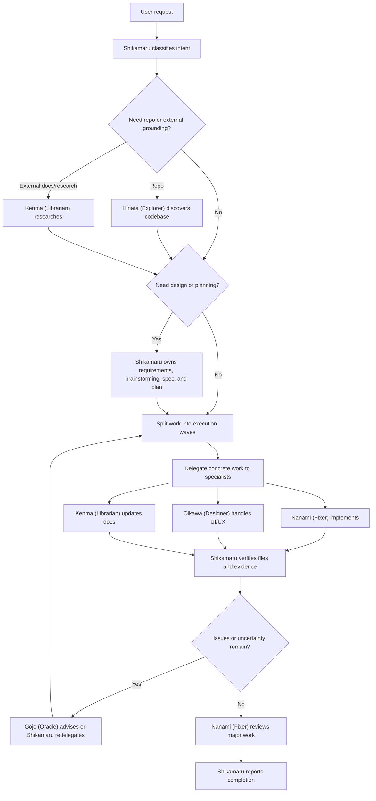

# opencode-config

> Seven divine beings emerged from the dawn of code, each an immortal master of their craft — they await your command to forge order from chaos and build what was once thought impossible.

Reusable [OpenCode](https://opencode.ai) config for agents, commands, skills, plugins, and workflows (including MCP-backed tools where configured).

Inspired by [oh-my-opencode-slim](https://github.com/alvinunreal/oh-my-opencode-slim), [oh-my-openagent](https://github.com/code-yeongyu/oh-my-openagent), and the [planning-with-files](https://github.com/OthmanAdi/planning-with-files) workflow.

## Install

```bash
curl -fsSL https://raw.githubusercontent.com/benihime91/opencode-config/refs/heads/main/install.sh | bash
```

The installer clones the repo, backs up your existing config, symlinks files into `~/.config/opencode`, installs dependencies, and bootstraps a local Firecrawl instance by default when Docker with `docker compose` is available.
It also links `agent-permissions.jsonc` for per-agent skill rules.
The default Firecrawl env now lives in this repo at `firecrawl/.env.default`. During bootstrap, the installer updates only the Ollama-related lines, then links `~/firecrawl/.env` back to that repo-owned file so you edit one source of truth.

### Override defaults

You can point the installer at a fork or a different clone path with environment variables:

```bash
OPENCODE_CONFIG_REPO_SLUG="your-user/opencode-config" \
OPENCODE_CONFIG_CLONE_DIR="$HOME/src/opencode-config" \
curl -fsSL https://raw.githubusercontent.com/benihime91/opencode-config/refs/heads/main/install.sh | bash
```

Supported overrides:

- `OPENCODE_CONFIG_REPO_SLUG`
- `OPENCODE_CONFIG_REPO_URL`
- `OPENCODE_CONFIG_CLONE_DIR`
- `OPENCODE_CONFIG_DIR`
- `OPENCODE_INSTALL_FIRECRAWL` (`0` to skip local Firecrawl bootstrap)
- `OPENCODE_FIRECRAWL_DIR`
- `OPENCODE_FIRECRAWL_REPO_URL`

To bootstrap from a local git checkout instead of GitHub, set `OPENCODE_CONFIG_REPO_URL` to that local repository path.

## Finish Setup

```bash
source ~/.zshrc   # or ~/.bashrc
opencode auth
export EXA_API_KEY=<your-key>   # optional, for Exa MCP
# Optional: local Firecrawl / scraping (see mcp.firecrawl env in opencode.json)
# export FIRECRAWL_API_KEY=...
# Context+ embeddings use Ollama; model name is set in opencode.json (OLLAMA_EMBED_MODEL)
opencode
```

MCP servers are configured directly in `~/.config/opencode/opencode.json` under the `mcp` key.

Built-in agents `explore` and `general` are set to `disable: true` in this repo’s `opencode.json`; primary use is the custom roster below. Entries for `build`, `general`, and `plan` in `agent-permissions.jsonc` still apply when those agents are used.

By default, the installer also attempts to bring up a local Firecrawl instance at `http://localhost:3002` using Docker Compose. If Docker is missing, it skips that step with a warning. The bootstrap links `~/firecrawl/.env` to `firecrawl/.env.default` from this repo so edits happen in one place.

```bash
OPENCODE_INSTALL_FIRECRAWL=0 curl -fsSL https://raw.githubusercontent.com/benihime91/opencode-config/refs/heads/main/install.sh | bash
```

## Manual Install

```bash
git clone https://github.com/benihime91/opencode-config.git ~/opencode-config
mkdir -p ~/.config/opencode
ln -sf ~/opencode-config/opencode.json ~/.config/opencode/opencode.json
ln -sf ~/opencode-config/agent-permissions.jsonc ~/.config/opencode/agent-permissions.jsonc
ln -sf ~/opencode-config/dcp.jsonc ~/.config/opencode/dcp.jsonc
ln -sf ~/opencode-config/tui.json ~/.config/opencode/tui.json
ln -sfn ~/opencode-config/agents ~/.config/opencode/agents
ln -sfn ~/opencode-config/commands ~/.config/opencode/commands
ln -sfn ~/opencode-config/plugins ~/.config/opencode/plugins
ln -sfn ~/opencode-config/rules ~/.config/opencode/rules
ln -sfn ~/opencode-config/skills ~/.config/opencode/skills
ln -sfn ~/opencode-config/themes ~/.config/opencode/themes
cd ~/opencode-config && (bun install || npm install)
ln -sfn ~/opencode-config/node_modules ~/.config/opencode/node_modules

# optional: bootstrap local Firecrawl (matches the installer default when Docker is available)
git clone https://github.com/firecrawl/firecrawl.git ~/firecrawl
ln -sfn ~/opencode-config/firecrawl/.env.default ~/firecrawl/.env
docker compose -f ~/firecrawl/docker-compose.yaml build
docker compose -f ~/firecrawl/docker-compose.yaml up -d
```

## Update

```bash
cd ~/opencode-config && git pull && bash install.sh
```

Symlinks keep changes live immediately.

If you installed to a different clone directory, run the same command from that directory instead.

## What's Included

- `agents/` — the Seven Divine Beings and their specialist roles
- `commands/` — 10 slash commands including `/code-review`, `/commit-push`, `/learn`, `/refactor-clean`, and more
- `skills/` — 31 reusable workflows covering planning, research, frontend, writing, browser automation, and more
- `plugins/` — local plugins for planning hooks, skill permissions, and skill enforcement
- `rules/` — 3 instruction files loaded by `opencode.json` (agent workflow, writing standards, browser automation)
- `firecrawl/.env.default` — repo-owned Firecrawl env with Ollama defaults managed from one place
- `tui.json` — TUI configuration (van-helsing theme)

---

## The Seven Divine Beings

> Forged in the void of complexity, they emerged when the first codebase collapsed under its own weight. Neither mortal nor machine would claim responsibility — so The Seven arose, each an immortal master of their domain.

### Primary Agents


| #   | Agent       | Title                | Anime  | Model                         | Role                                                                                                                                                                              |
| --- | ----------- | -------------------- | ------ | ----------------------------- | --------------------------------------------------------------------------------------------------------------------------------------------------------------------------------- |
| 01  | `shikamaru` | **The Orchestrator** | Naruto | openai/gpt-5.4               | Master delegator and strategic coordinator. Plans 200 moves ahead. Owns requirements, design, specs, and plans. Delegates to specialists in execution waves, then verifies.       |
| 02  | `urahara`   | **The Builder**      | Bleach | openai/gpt-5.4               | Pair-programming partner and inventor. Builds impossible solutions to impossible problems. Handles direct coding tasks end-to-end. Shares planning-file ownership with Shikamaru. |


### Specialist Subagents


| #   | Agent    | Title             | Anime   | Model                                          | Role                                                                                                                                       |
| --- | -------- | ----------------- | ------- | ---------------------------------------------- | ------------------------------------------------------------------------------------------------------------------------------------------ |
| 03  | `hinata` | **The Explorer**  | Haikyuu | anthropic/claude-sonnet-4-5                    | Fast read-only codebase reconnaissance — finds files, traces symbols, maps architecture.                                                   |
| 04  | `gojo`   | **The Oracle**    | JJK     | openai/gpt-5.4                                | Strategic advisor and technical architect — architecture decisions, high-level design, code review, trade-off analysis, and ADRs.           |
| 05  | `kenma`  | **The Librarian** | Haikyuu | google-vertex/gemini-3.1-pro-preview-customtools | External docs and library research with evidence, plus documentation authorship.                                                           |
| 06  | `oikawa` | **The Designer**  | Haikyuu | google-vertex/gemini-3.1-pro-preview-customtools | UI/UX specialist — visual direction, responsive layouts, design systems, interaction design. Higher temperature (0.7) for creative work.    |
| 07  | `nanami` | **The Fixer**     | JJK     | openai/gpt-5.4                                | Deep local execution specialist — implementation, code review, refactoring, and cleanup. Turns specification into working code.             |


### Skill Permissions

Each agent has a scoped set of allowed skills defined in `agent-permissions.jsonc`. Primary agents (Shikamaru, Urahara) have full access. Subagents get only the skills relevant to their role:

- **Hinata** (3): `repo-discovery`, `agent-browser`, `simplify`
- **Gojo** (12): `brainstorming`, `writing-plans`, `agent-harness-construction`, `repo-discovery`, `docs-research`, `deep-research`, `exa-search`, `firecrawl`, `agent-browser`, `simplify`, `modular-code-enforcement`, `python-coding-style`
- **Kenma** (11): `repo-discovery`, `docs-research`, `deep-research`, `exa-search`, `firecrawl`, `article-writing`, `writing-clearly-and-concisely`, `writing-plans`, `writing-skills`, `agent-browser`, `simplify`
- **Oikawa** (15): `repo-discovery`, `docs-research`, `exa-search`, `firecrawl`, `frontend-design`, `frontend-patterns`, `frontend-slides`, `liquid-glass-design`, `agentation`, `annotation-sync`, `agentation-self-driving`, `dogfood`, `agent-browser`, `simplify`, `modular-code-enforcement`
- **Nanami** (8): `executing-plans`, `dogfood`, `repo-discovery`, `writing-clearly-and-concisely`, `simplify`, `agent-browser`, `modular-code-enforcement`, `python-coding-style`

---

## Orchestrator Workflow

The Shikamaru orchestration flow follows a delegated, wave-based loop:




### Planning Workflow (Manus-style + .plans/)

The planning system combines the [Manus 3-file pattern](https://github.com/OthmanAdi/planning-with-files) with a structured specs directory:

```
.plans/
├── task_plan.md          <- Canonical task state, phase tracking, active artifacts index
├── findings.md           <- Research discoveries, user corrections, lessons learned
├── progress.md           <- Session log, test results, what was done
└── specs/
    └── YYYY-MM-DD-*.md   <- Design specs from brainstorming, implementation plans from writing-plans
```

**Core principle**: `Context Window = RAM` (volatile, limited). `Filesystem = Disk` (persistent, unlimited). Use this pattern for **long-running, multi-session, or high-risk** work (or when you explicitly choose disk-backed planning); ordinary tasks do not need `.plans/` by default.

---

## Rules

Three cross-cutting rules in `rules/` govern all agent behavior:


| Rule                    | Scope                                                                             |
| ----------------------- | --------------------------------------------------------------------------------- |
| `agent-workflow.md`     | Work scoping, planning gates, evidence standards, parallelism, research hierarchy |
| `agent-writing.md`      | Prose quality, context budget, naming, source-backed claims                       |
| `browser-automation.md` | UI freshness, verification, sessions, observation modes                           |


Code style policies (modular code enforcement, Python coding style) are now delivered as skills rather than always-loaded rules, so they activate only when relevant.

---

## Skills (31)


| Category          | Skills                                                                                   |
| ----------------- | ---------------------------------------------------------------------------------------- |
| **Planning**      | planning-with-files, brainstorming, writing-plans, executing-plans                       |
| **Research**      | deep-research, docs-research, exa-search, firecrawl, repo-discovery                     |
| **Frontend**      | frontend-design, frontend-patterns, frontend-slides, liquid-glass-design                 |
| **Writing**       | article-writing, writing-clearly-and-concisely, writing-skills                           |
| **Browser**       | agent-browser, dogfood, agentation, agentation-self-driving                              |
| **Orchestration** | dispatching-parallel-agents, annotation-sync                                             |
| **Coding**        | simplify, modular-code-enforcement, python-coding-style                                  |
| **Meta**          | rules-distill, agent-harness-construction                                                |
| **Media**         | manim-video, electron, slack, vercel-sandbox                                             |


---

## Commands (10)


| Command                  | Description                                             |
| ------------------------ | ------------------------------------------------------- |
| `/commit-push`           | Commit and push changes to the current branch           |
| `/commit-push-pr`        | Commit, push, and open a PR                             |
| `/code-review`           | Review code for quality, security, and maintainability  |
| `/learn`                 | Extract patterns and learnings from the current session |
| `/update-docs`           | Update documentation for recent changes                 |
| `/refactor-clean`        | Remove dead code and consolidate duplicates             |
| `/prompt-optimize`       | Analyze a draft prompt and output an optimized version  |
| `/skill-create`          | Generate skills from git history analysis               |
| `/agent-permissions-debug` | Inspect resolved agent skill allowlists and discovery |
| `/rollback`              | Rollback to a previous checkpoint or N commits back     |


---

## MCP Servers

Configured natively in `opencode.json`:


| Server        | Purpose                                                 |
| ------------- | ------------------------------------------------------- |
| `contextplus` | Local semantic embeddings via Ollama (`OLLAMA_EMBED_MODEL` in `opencode.json`, e.g. `nomic-embed-text-v2-moe:latest`) |
| `firecrawl`   | Web scraping and extraction (local instance)            |
| `agentation`  | Design annotation toolbar                               |
| `context7`    | Library documentation                                   |
| `exa`         | Web search, code context, company research              |


---

## License

MIT
