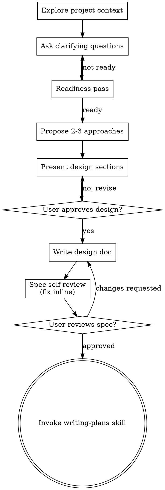

# Brainstorming Ideas Into Designs

Turn a loose request into an approved design. Start with project context, ask one question at a time, present options, and stop at design approval.

<HARD-GATE>
Do not take implementation action until you have presented a design and the user has approved it.
</HARD-GATE>

## When To Use

- feature requests
- behavior changes
- refactors with unclear desired outcomes
- multi-step work with open design choices
- any request where success criteria are not yet concrete

Skip this skill only when the task is already implementation-ready and the desired outcome is precise.

## Core Flow

1. Explore the current project context.
2. Ask one clarifying question at a time.
3. Run a lightweight readiness pass.
4. Present 2-3 viable options with a recommendation.
5. Present the design and get approval.
6. If needed, write the design to `.plans/specs/YYYY-MM-DD-<topic>-design.md`.
7. Register any written spec in `.plans/task_plan.md` under `Active Artifacts`.
8. If the workflow needs an implementation plan, hand off to `writing-plans` after approval.

## Readiness Pass

- Confirm these are clear enough before presenting options:
  - intended outcome
  - scope
  - known constraints
  - success criteria
  - non-goals
  - decision boundaries
- If they are not clear enough, keep clarifying one question at a time.
- Keep the process proportional. Simple work still needs a short design, not a ceremony.

## Design Shape

Present options in this structure:

- **Principles**
- **Decision Drivers**
- **Viable Options**
- **Recommendation**

Use sections only as large as the task needs.

## Question Rules

- Use the native `question` tool.
- Ask one question per message.
- Prefer multiple choice when it keeps the user moving.
- If the task is too large for one spec, decompose it before going deeper.

## Written Spec

- Write a spec only when the task or workflow needs one.
- Save it to `.plans/specs/YYYY-MM-DD-<topic>-design.md` unless the user wants another path.
- Re-read it once for placeholders, contradictions, ambiguity, and scope drift.
- Ask the user to review the written spec before moving into implementation planning.

## Output Contract

- End at design approval.
- Do not delegate spec writing.
- Do not move into implementation before approval.
- Use `writing-plans` next only when a written implementation plan is required.

## Process Flow

