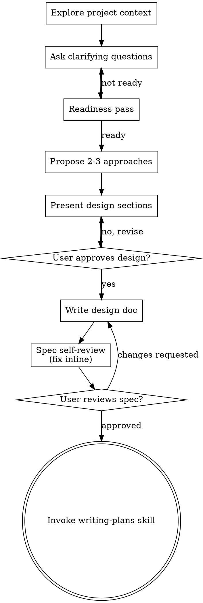

# Brainstorming Ideas Into Designs

Help turn ideas into fully formed designs and specs through natural collaborative dialogue. Always use the native `question` tool provided to ask clarifying questions. This tool allows the LLM to ask the user questions during a task.

Start by understanding the current project context, then ask questions one at a time to refine the idea. Once you understand what you're building, present the design and get user approval.

<HARD-GATE>
Do NOT invoke any implementation skill, write any code, scaffold any project, or take any implementation action until you have presented a design and the user has approved it. This applies to EVERY project regardless of perceived simplicity.
</HARD-GATE>

## Anti-Pattern: "This Is Too Simple To Need A Design"

Do not skip design just because the task looks small. Simple work still needs a short explicit design and user approval before implementation. Keep the process proportional: a few sentences may be enough when the work is straightforward.

## Checklist

Use this sequence, scaled to the size and ambiguity of the work:

1. **Explore project context** — check files, docs, recent commits
2. **Ask clarifying questions** — one at a time, understand purpose/constraints/success criteria
3. **Run a readiness pass** — check whether intent, scope, constraints, success criteria, non-goals, and decision boundaries are clear enough
4. **Propose 2-3 approaches** — with trade-offs and your recommendation
5. **Present design** — in sections scaled to the complexity, get user approval before implementation
6. **Write design doc when needed** — save to `.plans/specs/YYYY-MM-DD-<topic>-design.md` when the task or workflow calls for a written spec
7. **Spec self-review** — if you wrote a spec, do a quick inline check for placeholders, contradictions, ambiguity, and scope (see below)
8. **User reviews written spec** — if a spec was written, ask the user to review it before proceeding
9. **Transition to implementation planning** — invoke writing-plans when the workflow calls for a written implementation plan

## Process Flow

**The terminal state is design approval.** If the workflow requires a written implementation plan, the next skill is writing-plans. Do NOT invoke frontend-design, mcp-builder, or any implementation skill before the design is approved.

## The Process

**Understanding the idea:**

- Check out the current project state first (files, docs, recent commits)
- Before asking detailed questions, assess scope: if the request describes multiple independent subsystems (e.g., "build a platform with chat, file storage, billing, and analytics"), flag this immediately. Don't spend questions refining details of a project that needs to be decomposed first.
- If the project is too large for a single spec, help the user decompose into sub-projects: what are the independent pieces, how do they relate, what order should they be built? Then brainstorm the first sub-project through the normal design flow. Each sub-project gets its own spec → plan → implementation cycle.
- For appropriately-scoped projects, ask questions one at a time to refine the idea
- Prefer multiple choice questions when possible, but open-ended is fine too
- Only one question per message - if a topic needs more exploration, break it into multiple questions
- Focus on understanding: purpose, constraints, success criteria

**Readiness pass:**

- Before proposing approaches, check whether these are clear enough:
  - intent clarity
  - scope clarity
  - known constraints
  - success criteria
  - non-goals
  - decision boundaries
- If they are clear enough, move forward
- If not, keep clarifying one question at a time
- Keep this lightweight. The goal is clarity, not ritual.
- Do not force simple work through a long interview loop just to satisfy the process
- Use the readiness pass as the authority on whether more clarification is needed

**Exploring approaches:**

- Propose 2-3 different approaches with trade-offs
- Present options conversationally with your recommendation and reasoning
- Lead with your recommended option and explain why
- Use a clear design shape when you present the decision:
  - **Principles** — the rules or values guiding the design
  - **Decision Drivers** — the factors that matter most here
  - **Viable Options** — 2-3 realistic paths with trade-offs
  - **Recommendation** — the option you recommend and why

**Presenting the design:**

- Once you believe you understand what you're building, present the design
- Scale each section to its complexity: a few sentences if straightforward, up to 200-300 words if nuanced
- Ask for confirmation in a way that fits the task; section-by-section is useful for larger or riskier work, but simple work can stay short
- Keep the output structured, but keep the process light for straightforward work
- Cover: architecture, components, data flow, error handling, testing
- Be ready to go back and clarify if something doesn't make sense

**Design for isolation and clarity:**

- Break the system into smaller units that each have one clear purpose, communicate through well-defined interfaces, and can be understood and tested independently
- For each unit, you should be able to answer: what does it do, how do you use it, and what does it depend on?
- Can someone understand what a unit does without reading its internals? Can you change the internals without breaking consumers? If not, the boundaries need work.
- Smaller, well-bounded units are also easier for you to work with - you reason better about code you can hold in context at once, and your edits are more reliable when files are focused. When a file grows large, that's often a signal that it's doing too much.

**Working in existing codebases:**

- Explore the current structure before proposing changes. Follow existing patterns.
- Where existing code has problems that affect the work (e.g., a file that's grown too large, unclear boundaries, tangled responsibilities), include targeted improvements as part of the design - the way a good developer improves code they're working in.
- Don't propose unrelated refactoring. Stay focused on what serves the current goal.

## After the Design

**Documentation:**

- When the task or surrounding workflow calls for a written spec, write the validated design to `.plans/specs/YYYY-MM-DD-<topic>-design.md`
  - (User preferences for spec location override this default)
- After writing or replacing a spec, update the `Active Artifacts` section in `.plans/task_plan.md` with the exact spec path.
- Use elements-of-style:writing-clearly-and-concisely skill if available
- Do not treat a git commit as automatic; only commit when the user explicitly asks or the active workflow explicitly requires it

**Spec Self-Review:**
If you wrote a spec document, look at it with fresh eyes:

1. **Placeholder scan:** Any "TBD", "TODO", incomplete sections, or vague requirements? Fix them.
2. **Internal consistency:** Do any sections contradict each other? Does the architecture match the feature descriptions?
3. **Scope check:** Is this focused enough for a single implementation plan, or does it need decomposition?
4. **Ambiguity check:** Could any requirement be interpreted two different ways? If so, pick one and make it explicit.

Fix any issues inline. No need to re-review — just fix and move on.

**User Review Gate:**
If a written spec exists, ask the user to review it before proceeding:

> "Spec written to `<path>`. Please review it and let me know if you want to make any changes before we start writing out the implementation plan."

Wait for the user's response. If they request changes, make them and re-run the spec review loop. Only proceed once the user approves.

**Implementation:**

- NEVER DELEGATE WRITING THE SPEC. Always write it yourself.
- If the workflow requires a written implementation plan, invoke the writing-plans skill to create it
- Do NOT invoke any implementation skill before the design is approved. When a written plan is required, writing-plans is the next step.

## Key Principles

- **One question at a time** - Don't overwhelm with multiple questions
- **Multiple choice preferred** - Easier to answer than open-ended when possible
- **Readiness before approaches** - Check clarity before proposing options, then keep moving once the basics are clear
- **YAGNI ruthlessly** - Remove unnecessary features from all designs
- **Explore alternatives** - Always propose 2-3 approaches before settling
- **Structured output, light process** - Use Principles, Decision Drivers, Viable Options, and Recommendation without turning it into a ritual
- **Incremental validation** - Present design, get approval before moving on
- **Be flexible** - Go back and clarify when something doesn't make sense
